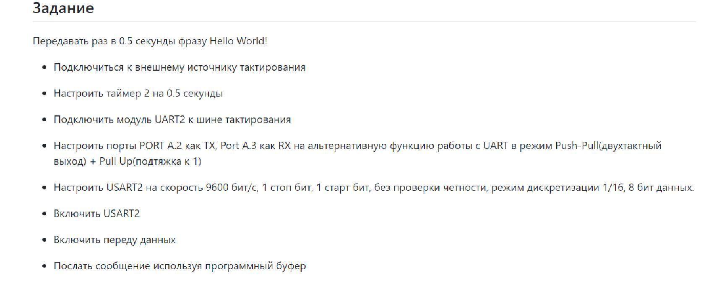
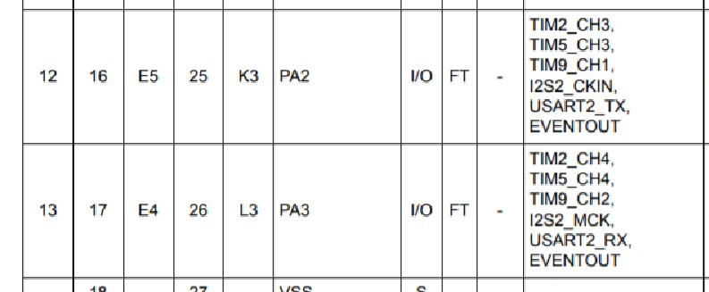
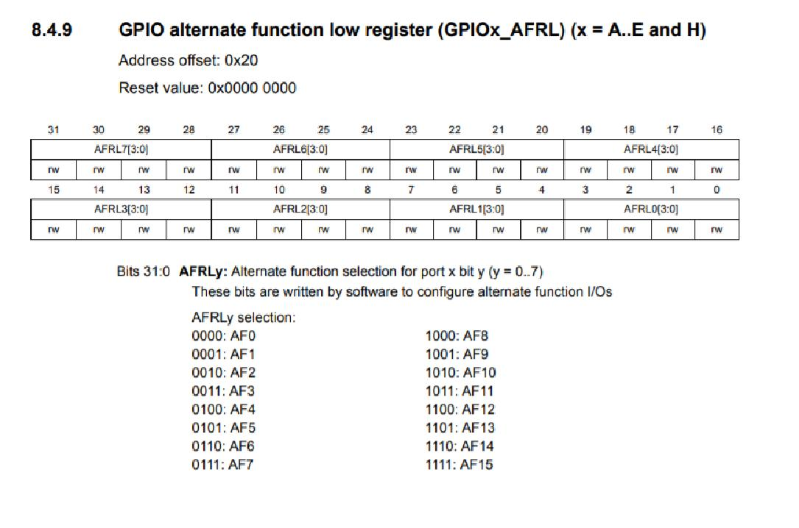

=== _Задание_:

=== _Выполнение задания_:

Для начала необходимо было определить порты выхода и входа USART (т.е
RX и TX).

Данные порты необходимо подключить в альтернативном режиме:

После чего необходимо запустить их в режиме Push-Pull и Pull Up.

----
    GPIOA::MODER::MODER3::Alternate::Set(); // TX
    GPIOA::MODER::MODER2::Alternate::Set(); //RX
    GPIOA::AFRL::AFRL2::Af7::Set(); // Альтернативный режим
    GPIOA::AFRL::AFRL3::Af7::Set();
    GPIOA::OTYPER::OT2::OutputPushPull::Set(); // Пуш пул
    GPIOA::OTYPER::OT3::OutputPushPull::Set();
    GPIOA::PUPDR::PUPDR2::PullUp::Set();   // Пулл пул
    GPIOA::PUPDR::PUPDR3::PullUp::Set();
----

Далее настраиваем остальные параметры по заданию:

----
    USART2::CR1::M::Data8bits::Set(); // 8 бит
    USART2::CR1::PCE::ParityControlDisable::Set(); // четность
    USART2::CR1::OVER8::OversamplingBy16::Set(); // дискретизация 1/16
    USART2::CR2::STOP::Value0::Set(); //1 стоп-бит
    USART2::BRR::Write((8'000'000/(9600*8*2) << 4U)); //скорость
----

Включаем USART и разрешаем передачу:

____
    USART2::CR1::UE::Enable::Set();
    USART2::CR1::TE::Enable::Set();
____

В main, в цикле for прописываем следующую строку, для передчи символа "А":

----
USART2::DR::Write('A');
----

После чего подключаем программу Terminal, где выводится данная буква.
Однако, в попытке подключить таймер 2:

----
//    NVIC::ISER2::Write(1<<28); // òàéìåð
//    TIM2::CR1::URS::OverflowEvent::Set();
//    RCC::APB1ENR::TIM2EN::Enable::Set();
//    TIM2::PSC::Set(7999U);
//    TIM2::ARR::Write(500);
//    TIM2::SR::UIF::NoInterruptPending::Set();
//    TIM2::CNT::Write(0U);
//    TIM2::DIER::UIE::Enable::Set();
//    TIM2::CR1::CEN::Enable::Set();
----

Была утрачена возможность передавать данные, они выводятся искаженными,
также удавалось передавать фразу "Hello, world! ", однако и она не получается.

=== _Код программы

----
#include "rccregisters.hpp"
#include "adc1registers.hpp"
#include "gpiocregisters.hpp"
#include "gpioaregisters.hpp"
#include <iostream>
#include <bitset>
#include "nvicregisters.hpp"
#include "adccommonregisters.hpp"
#include "usart2registers.hpp"
#include "tim2registers.hpp"

extern "C"
{
  int __low_level_init(void)
  {
    RCC::CR::HSEON::On::Set();
    while(!RCC::CR::HSERDY::Ready::IsSet())
    {
    }

    RCC::CFGR::SW::Hse::Set();
    while(!RCC::CFGR::SWS::Hse::IsSet())
    {
    }
    RCC::CR::HSION::Off::Set();

    RCC::AHB1ENR::GPIOAEN::Enable::Set();
    GPIOA::MODER::MODER0::Analog::Set();
    GPIOA::MODER::MODER3::Alternate::Set(); // TX
    GPIOA::MODER::MODER2::Alternate::Set(); //RX
    GPIOA::AFRL::AFRL2::Af7::Set(); // ôóíêöèÿ àëüòåðíàòèâíîãî ïîðòà
    GPIOA::AFRL::AFRL3::Af7::Set();
    GPIOA::OTYPER::OT2::OutputPushPull::Set();
    GPIOA::OTYPER::OT3::OutputPushPull::Set();
    GPIOA::PUPDR::PUPDR2::PullUp::Set();
    GPIOA::PUPDR::PUPDR3::PullUp::Set(); // ìóòü ñ ïîðòàìè

//    NVIC::ISER2::Write(1<<28); // òàéìåð
//    TIM2::CR1::URS::OverflowEvent::Set();
//    RCC::APB1ENR::TIM2EN::Enable::Set();
//    TIM2::PSC::Set(7999U);
//    TIM2::ARR::Write(500);
//    TIM2::SR::UIF::NoInterruptPending::Set();
//    TIM2::CNT::Write(0U);
//    TIM2::DIER::UIE::Enable::Set();
//    TIM2::CR1::CEN::Enable::Set();

    RCC::APB2ENR::ADC1EN::Enable::Set();
    RCC::APB1ENR::USART2EN::Enable::Set(); // òàêòèððîâàíèå

    USART2::CR1::M::Data8bits::Set(); // 8 áèò äëèíà
    USART2::CR1::PCE::ParityControlDisable::Set(); // ÷åòíîñòü
    USART2::CR1::OVER8::OversamplingBy16::Set(); // äèñêðåòèçàöèÿ 1/16
    USART2::CR2::STOP::Value0::Set(); //1 ñòîï áèò
    USART2::BRR::Write((8'000'000/(9600*8*2) << 4U)); //ñêîðîñòü
    USART2::CR1::UE::Enable::Set(); //âêëþ÷åíèå
    USART2::CR1::TE::Enable::Set();

    ADC_Common::CCR::TSVREFE::Enable::Set();
    ADC1::CR1::RES::Bits12::Set();
    ADC1::CR1::SCAN::Enable::Set();
    ADC1::CR2::ADON::Enable::Set();

    ADC1::SQR3::SQ1::Channel18::Set();
    ADC1::SQR3::SQ2::Channel17::Set();
    ADC1::SQR3::SQ3::Channel0::Set();

    ADC1::CR2::CONT::SingleConversion::Set();
    ADC1::SQR1::L::Conversions3::Set();

    ADC1::CR2::EOCS::SingleConversion::Set();
    //ADC1::CR1::OVRIE::Enable::Set();

    return 1;
  }
}

int main()
{

  const auto Ts_Cal1 = static_cast<float> (*reinterpret_cast<uint16_t*>(0x1FFF7A2C));

  const auto Ts_Cal2 = static_cast<float> (*reinterpret_cast<uint16_t*>(0x1FFF7A2E));

  const auto Vref = static_cast<float> (*reinterpret_cast<uint16_t*>(0x1FFF7A2A));

  const char myString[] = "Hello, world! " ;

  for (;;)
  {

    //ADC1::SR::OVR::NoOverrun::Set();
    //ADC1::SR::STRT::Started::Set();

/*
    ADC1::CR2::SWSTART::On::Set();
    while(!ADC1::SR::EOC::ConversionComplete::IsSet())
    {
    }

    uint32_t Temp_Data = ADC1::DR::DATA::Get();
    while(!ADC1::SR::EOC::ConversionComplete::IsSet())
    {
    }

    uint32_t Vref_Data = ADC1::DR::DATA::Get();
    while(!ADC1::SR::EOC::ConversionComplete::IsSet())
    {
    }

    uint32_t Res_Data = ADC1::DR::DATA::Get();

    float Temp =((Temp_Data - Ts_Cal1)*(110.0f-30.0f) + 30.0f*(Ts_Cal2 - Ts_Cal1)) / (Ts_Cal2 - Ts_Cal1);
    float k = Vref / Vref_Data;
    float Voltage = (Res_Data * 3.3 / 4096.0) * k;

    std::cout << "Òåìïåðàòóðà: " << Temp*k << " Ñ" << std::endl;
    std::cout << "Îïîðíîå íàïðÿæåíèå: " << Vref_Data << std::endl;
    std::cout << "Íàïðÿæåíèå " << Voltage << " V" << std::endl;
    std::cout << "_________________________________" << std::endl;
    for(int i=0; i<strlen(myString); i++)
    {
      USART2::DR::Write(myString[i]);
      while(USART2::SR::TXE::DataRegisterNotEmpty::IsSet())
      {
      }
    }
    */
    USART2::DR::Write('A');
  }
  return 0;
}

----